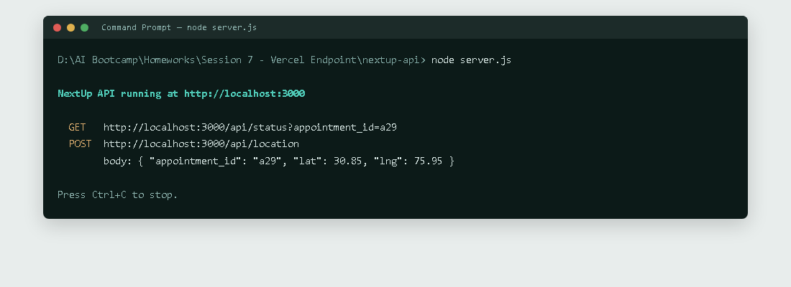
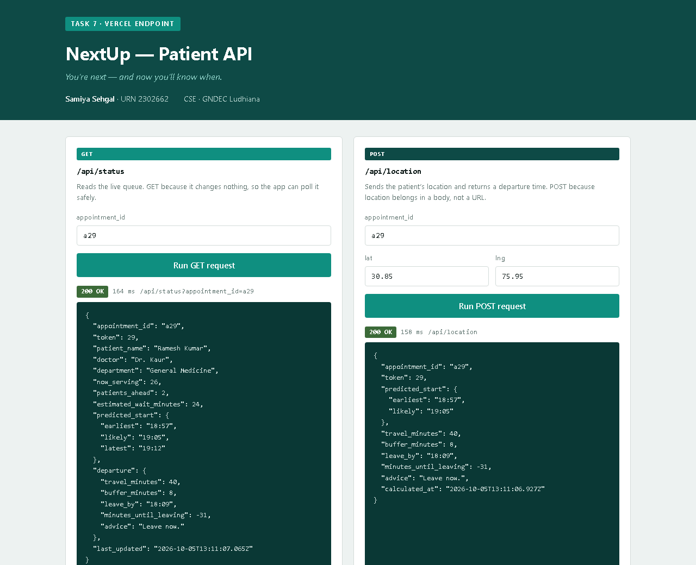
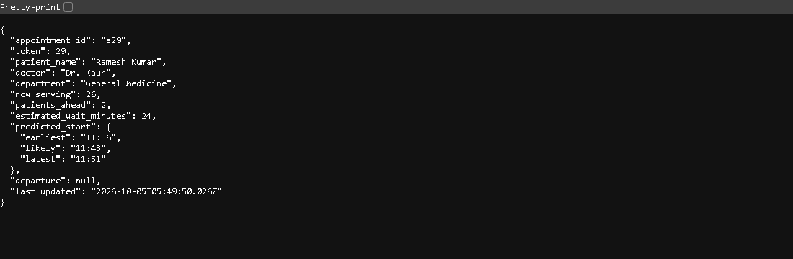

# Session 7 — Vercel Endpoint

**NextUp patient API** — a GET endpoint that returns a patient's live position
in a hospital OPD queue and when their consultation is likely to start.

Samiya Sehgal · URN 2302662
Department of Computer Science and Engineering, GNDEC Ludhiana

---

## The endpoint

```
GET /api/status?appointment_id=a29
```

| Item | Value |
|---|---|
| Method | GET — it only reads, so the app can poll it safely |
| Input | `appointment_id` as a query parameter |
| Output | JSON: token, patients ahead, predicted start time |
| Data | `lib/data.js` (mock appointments) |

A second endpoint, `POST /api/location`, takes the patient's coordinates in a
request body and returns a recommended departure time.

Both can be run from a **test page served at the root of the deployment**, so
one URL demonstrates the whole thing without curl or Postman.

---

## Part 1 — Running it locally

### Step 1. Open the project folder

Open Command Prompt and move into the project:

```bash
cd "D:\AI Bootcamp\Homeworks\Session 7 - Vercel Endpoint"
```

### Step 2. Start the server

No installation is needed — Node 18 or newer is enough.

```bash
node server.js
```



If port 3000 is already in use, the server automatically moves to 3001 and
prints the address it settled on. **Use the address it prints.**

### Step 3. Open the test page

```
http://localhost:3000/
```

A page with two buttons, one per endpoint. Each shows the status code, how
long the request took, and the JSON that came back.



Adding `?demo=1` to the URL runs both requests automatically on load, so a
single link shows the API already working:

```
http://localhost:3000/?demo=1
```

### Step 3b. Or call the endpoint directly

The GET endpoint also works straight from the address bar:

```
http://localhost:3000/api/status?appointment_id=a29
```



The POST endpoint cannot be called from an address bar because it needs a
request body — that is exactly what the button on the test page is for.

The response:

```json
{
  "appointment_id": "a29",
  "token": 29,
  "patient_name": "Ramesh Kumar",
  "doctor": "Dr. Kaur",
  "department": "General Medicine",
  "now_serving": 26,
  "patients_ahead": 2,
  "estimated_wait_minutes": 24,
  "predicted_start": {
    "earliest": "11:36",
    "likely": "11:43",
    "latest": "11:50"
  },
  "departure": null,
  "last_updated": "2026-10-05T05:49:14.980Z"
}
```

`predicted_start` is a **range**, not a single time, because consultation
lengths genuinely vary. That range is what makes a departure time computable.

### Step 4. Stop the server

Press `Ctrl + C` in the Command Prompt window.

---

## Part 2 — Deploying to Vercel

Vercel turns every file in the `/api` folder into its own serverless function,
named after the file. `api/status.js` becomes `/api/status` automatically —
no server code, no ports, no configuration.

`server.js` is only for local testing. **Vercel never runs it.**

### Step 1. Create a Vercel account

Go to **vercel.com** and sign up. Choose "Continue with GitHub" — it makes
redeploying easier later.

> **Screenshot to take:** `03-vercel-signup.png` — your Vercel dashboard
> after signing in.

### Step 2. Log in from the terminal

From inside the `Session 7 - Vercel Endpoint` folder:

```bash
npx vercel login
```

The first time, npx asks permission to install the Vercel CLI — type `y`.
Then pick your login method; a browser window opens to confirm.

> **Screenshot to take:** `04-vercel-login.png` — the terminal showing
> "Congratulations! You are now logged in."

### Step 3. Deploy

```bash
npx vercel
```

It asks about five questions. **Press Enter to accept every default:**

| Question | Answer |
|---|---|
| Set up and deploy? | `y` |
| Which scope? | your own account |
| Link to existing project? | `n` |
| Project name? | **type `nextup-api`** — do not accept the default, which is built from this folder's name and contains spaces |
| In which directory is your code? | Enter (`./`) |
| Modify build settings? | `n` |

You get a **preview URL**.

> **Screenshot to take:** `05-vercel-deploy.png` — the terminal output showing
> the preview URL.

### Step 4. Deploy to production

```bash
npx vercel --prod
```

This gives the clean public URL.

> **Screenshot to take:** `06-vercel-production.png` — the terminal showing
> the production URL.

### Step 5. Test the live deployment

Open the production URL. The test page loads at the root, and both buttons
call the live API:

```
https://nextup-api.vercel.app/
```

> **Screenshot to take:** `07-live-endpoint.png` — the browser showing the
> live Vercel URL with both responses filled in. **This is the most important
> screenshot in the submission.** Click both buttons first, or add `?demo=1`
> to the URL so they run by themselves.

The endpoint also works directly, which is worth including too:

```
https://nextup-api.vercel.app/api/status?appointment_id=a29
```

---

## Two things that look like errors but are not

**No port number in production.** Vercel handles routing, so the
`EADDRINUSE` problem that occurs locally simply does not exist once deployed.

**The data resets.** `lib/data.js` holds mock data in memory, and Vercel shuts
functions down when idle. The GET endpoint is unaffected because it recomputes
from the mock data on every request. The ETA saved by POST will not survive.

---

## Known limitations

Stated deliberately rather than hidden:

- **No authentication.** Anyone who guesses an appointment id can read it. A
  real version would check the signed-in patient against
  `appointment.patient_id` and return 403 otherwise.
- **No real database.** Mock data in `lib/data.js`.
- **Simple prediction.** Patients ahead multiplied by an average consultation
  length, with a fixed ±30% range.

---

## Submission checklist

| File | Status |
|---|---|
| `index.html` — test page with both buttons | included |
| `api/`, `lib/`, `server.js` — source code | included |
| `screenshots/01-server-running.png` | included |
| `screenshots/02-get-endpoint-browser.png` | included |
| `screenshots/03-test-page.png` | included |
| `screenshots/03-vercel-signup.png` | **you take this** |
| `screenshots/04-vercel-login.png` | **you take this** |
| `screenshots/05-vercel-deploy.png` | **you take this** |
| `screenshots/06-vercel-production.png` | **you take this** |
| `screenshots/07-live-endpoint.png` | **you take this** |
